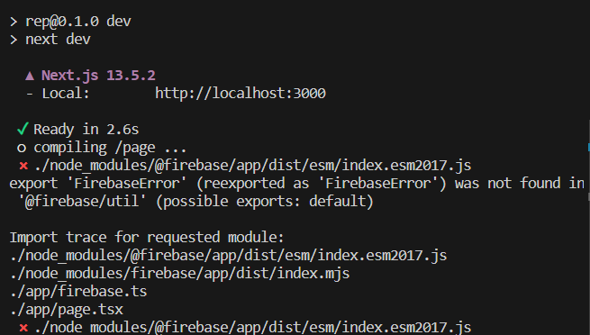
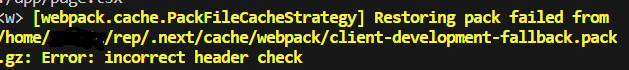
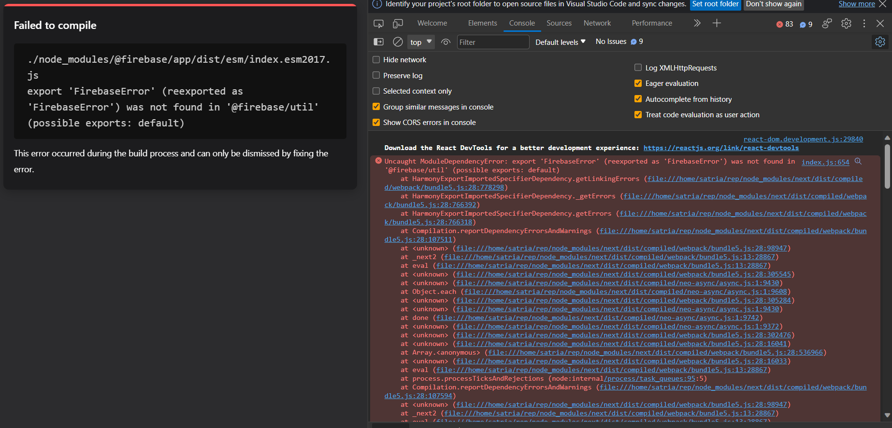

# Case: React PDF with FIrebase on Next 13 SSR

## How to reproduce

Add your firebase client credentials into `app/firebase.ts` then simply run `npm i && npm run dev`

### Console Error





### Browser Error



### Culprit

```javascript
// next.config.js

...
    webpack: (config) => {
    config.module.rules.push({
        test: /\.node/,
        use: "raw-loader",
    });
    },
...
```

### Possible Fix

What this config do is ignoring canvas error while Next app in SSR state. I whink this will be a better solution than forcing other library that relied onto `webpack` to use `raw-loader`.

```javascript
// next.config.js
...
    webpack: (config) => {
        config.resolve.alias.canvas = false;
        return config;
    },
...
```
